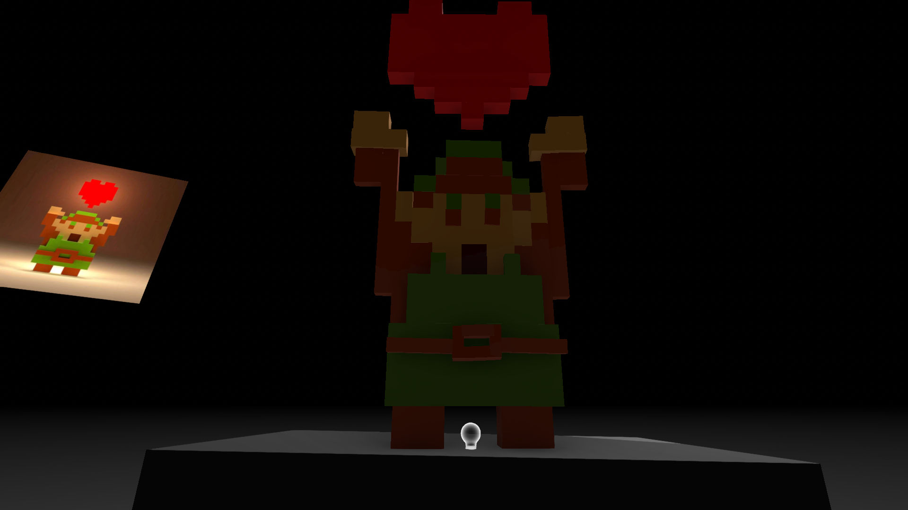
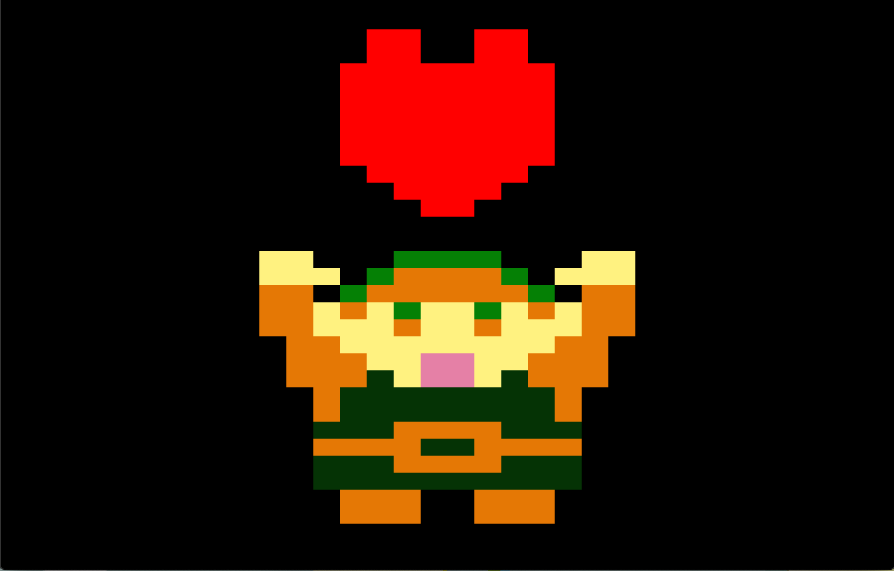
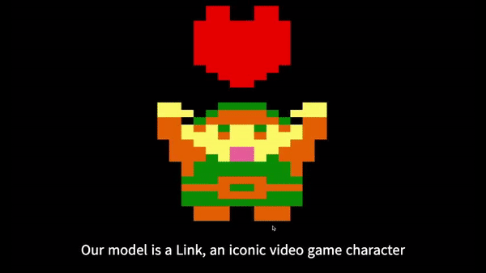

# Link

## Description
Final project for computer graphics class Aug-Dec 2019.

Project consists of replicating a model with Microsoft Maquette and OpenGl where we used the framework GLUT that comes default in Xcode.

In this repository you'll find the code and executable of the project in the ***Link*** folder and image evidence in the ***img*** folder.

The model counts with:
#### Translations

|Key|Action |
|----|:-----:|
|Horizontal tab key| Translate model right|
|Backspace key| Translate model left|
|A or a key| Translate model up|
|S or s key| Translate model down|
|Z or z key| Translate model close|
|X or x key| Translate model far|

#### Scaling

|Key|Action |
|----|:-----:|
|B or b key| Scale model to bigger size|
|L or l key| Scale model to smaller size|

#### Rotations

|Key|Action |
|----|:-----:|
|Left arrow key| Rotate model left|
|Right arrow key| Rotate model right|
|Up arrow key| Rotate model up|
|Down arrow key| Rotate model down|

#### Color & Texture

For the texture we use a darker green to make notice of the difference between the other objects that doesn't have texture.
We used the ***glTexImage2D*** function for texture.

- Texture
  -  `glColor3f(0.02f, 0.2f, 0.02f)`
    - Tunica
    
- Other objects
  -  `glColor3f(0.90f, 0.47f, 0.02f)`
    - Boots
    - Belt
    - Left arm
    - Right arm
    - Hair
    - Lower part of eyes
  -  `glColor3f(0.02f, 0.5f, 0.02f)`
    - Hat
    - Upper part of eyes
  -  `glColor3f(1.0f, 0.95f, 0.5f)`
    - Left hand
    - Right hand
    - Face
  -  `glColor3f(0.9f, 0.5f, 0.65f)`
    - Mouth
  -  `glColor3f(1.0f, 0.0f, 0.0f)`
    - Heart above Link

***

## Model in Microsoft Maquette
Image evidence of the model made in Microsoft Maquette with the real image of the model on the left.

***

## Model made in OpenGL
Image evidence of the model made in OpenGL with the colors already mentioned.

***

## Demonstration
Video recorded (before adding textures) of the transformations possible in the model

